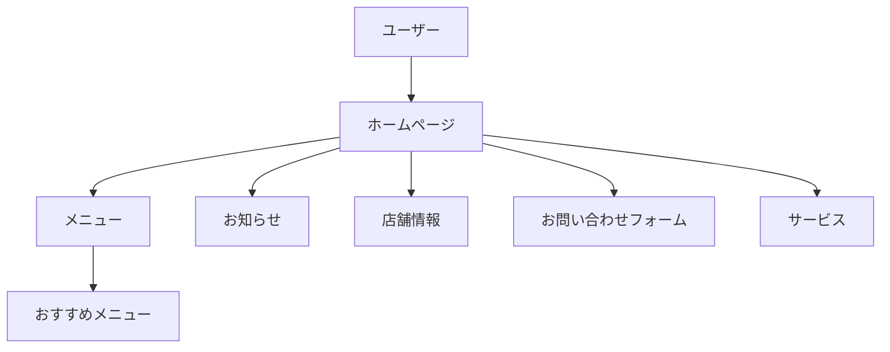

# 居酒屋「青い鳥」ホームページ - TOPページ

このウェブサイトは、居酒屋「青い鳥」の**架空のホームページ**です。新鮮な料理と心地よい雰囲気が自慢のお店で、季節限定のイベントやプロモーションも定期的に開催しています。

## 機能

このウェブサイトでは、以下の機能を提供しています。

- ヘッダー：ナビゲーションメニューを表示するコンポーネント
- バナー：店舗の紹介文と画像を表示するセクション
- サービス：当店のサービスを紹介するセクション
- おすすめメニュー：人気のあるメニューを紹介するセクション
- 店舗情報：店舗の情報を表示するセクション
- お知らせ：季節ごとのイベントやプロモーション情報を表示するセクション
- お問い合わせフォーム：顧客からのお問い合わせを受け付けるコンポーネント

## MERMAIDの構成図



## ディレクトリ構成

```bash
izakaya-aoitori/
├── contact.html
│   ├── css/
│   │   ├── contact.css
│   │   └── header.css
│   ├── img/
│   └── js/
│       └── components.js
├── css/
│   ├── header.css
│   ├── top.css
│   ├── menu.css
│   ├── store.css
│   ├── news.css
│   └── contact.css
├── img/
│   ├── banner.jpg
│   ├── menu1.jpg
│   ├── menu2.jpg
│   ├── menu3.jpg
│   ├── service1.jpg
│   ├── service2.jpg
│   ├── service3.jpg
│   └── tokyo-store.jpg
├── index.html
├── js/
│   └── components.js
├── menu.html
├── news.html
├── package-lock.json
├── package.json
├── screenshots/
│   ├── contact.png
│   ├── menu.png
│   ├── news.png
│   ├── stores.png
│   └── top-page.png
└── store.html
```